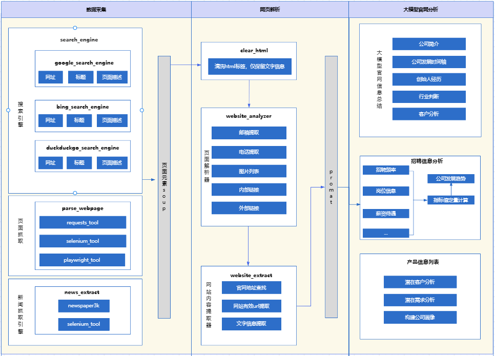
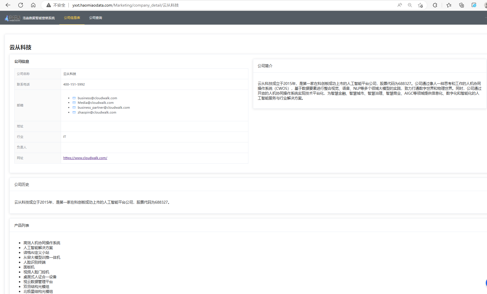

# 网站内容提取与分析工具

本工具是一个高效的网站内容提取与分析平台。用户可以自动化地获取企业官网信息，提升信息收集效率，是企业调研、竞品分析和市场研究的理想选择。

[English Version](./readme_en.md) | [中文版](./readme.md)

## 🖼️ 系统架构



*图1：LLM搜索工具系统架构图*

## 🎯 效果展示



*图2：系统效果展示*

## 项目初衷
本项目初衷是我开发的一个公司官网导航的自动化采集工具，能够通过搜索引擎获取公司官网，进行内容提取和分析，最终生成公司官网导航，目前，整个自动化采集官网信息提取功能已开源，公司官网导航信息生成功能正在开发中。大模型能力的代码整理后也将开源。
目前demo的项目地址：
http://yxxt.haomiaodata.com/
内容是采集的公司信息并基于模型提取的，目前还是demo版本，新版本的公司官网导航仍在开发中。

TODO:
引入大模型能力以分析网站并提取有价值信息，目前仅支持公司官网原始文本内容的提取。

## 🚀 主要功能与API接口
本项目的API接口基于FastAPI框架构建，提供高效、灵活的接口服务。

### 🔍 智能搜索引擎集成 `/search`
- 支持Google、Bing、DuckDuckGo等主流搜索引擎
- 可配置搜索引擎类型 (`engine_name`) 和过滤文本长度 (`filter_text_len`)
- 返回结构化的搜索结果，包含URL、标题和描述
- 自动过滤无关内容，精准定位目标信息
- 支持关键词搜索和高级搜索语法


### 📄 网页内容智能提取 `/webpage_info`
- 支持多种解析工具 (`requests`/`selenium`/`playwright`)
- 自动提取网页标题、正文内容
- 可选返回完整的HTML结构
- 智能处理动态渲染页面
- 内置错误处理和重试机制
- 支持自定义解析规则和内容过滤

### 🔎 深度网站分析 `/analyze`
- 全面分析网站结构和资源分布
- 自动收集并分类内部/外部链接
- 智能提取公司信息（社交媒体、邮箱、电话、地址）
- 统计JS、CSS、图片等资源分布
- 生成详细的JSON格式分析报告
- 支持网站地图生成和目录结构分析
- 提供SEO相关数据分析

### 🚄 批量内容提取 `/extract`
- 支持多页面并行处理
- 可配置最大抓取页数 (`max_page`)
- 可控制是否返回HTML结构 (`need_soup`)
- 自动递归抓取相关页面
- 内置限速和负载均衡
- 支持自定义抓取规则和过滤条件
- 提供断点续传功能

## ⚡ 快速开始

### 系统要求

- Python 3.9或更高版本
- Chrome浏览器（用于Selenium和Playwright渲染）
- 至少2GB可用内存
- 稳定的网络连接

### 🔧 安装步骤

1. 克隆代码库:
   ```bash
   git clone git@github.com:BetaStreetOmnis/WebAIExtracto.git
   ```

2. 安装依赖:
   ```bash
   pip install -r requirements.txt
   ```

3. 启动API服务:
   ```bash
   python api_server.py
   ```
   服务将在 [http://localhost:8093](http://localhost:8093) 启动，可通过Swagger UI查看完整API文档。

